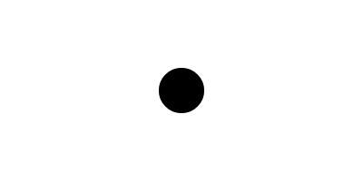
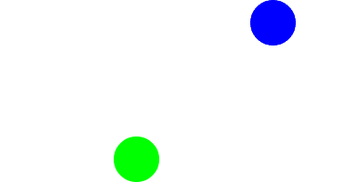
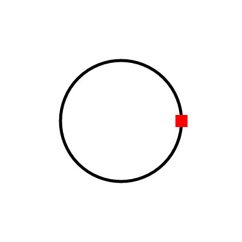
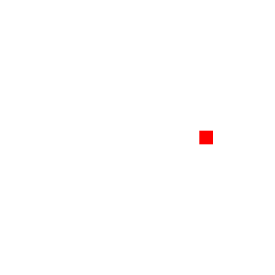
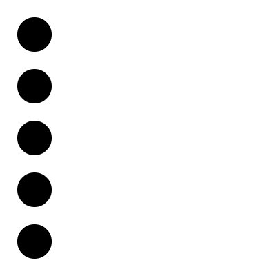
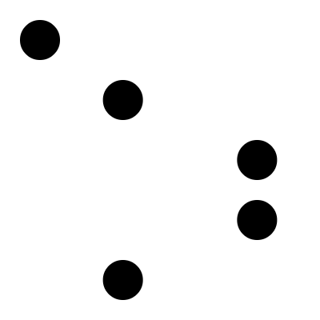
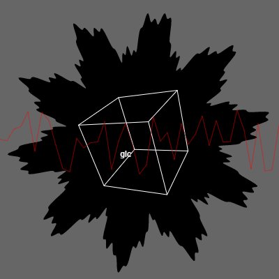
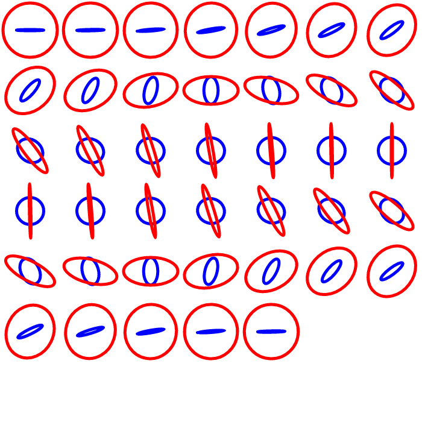
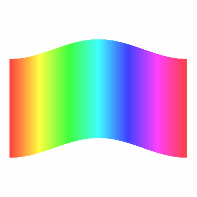
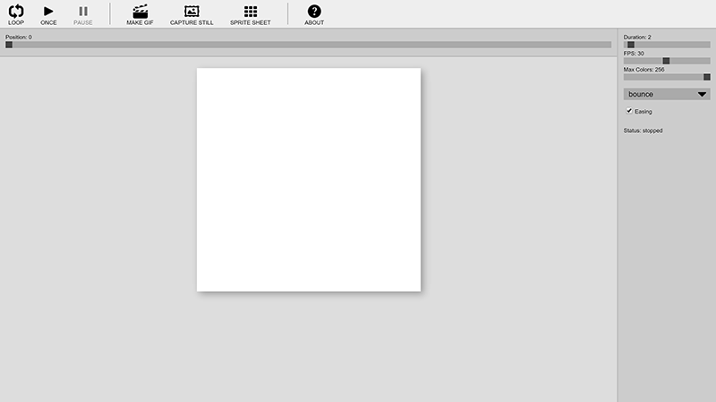

[Home](http://gifloopcoder.com)

# GIF Loop Coder (GLC) Documentation

Table of Contents

1.  [Introduction to GIF Loop Coder (GLC)](intro.html)
2.  [Objects](objects.html)
3.  [Styles](styles.html)
4.  [Property Types](properties.html)
5.  Tips and Advanced Use
  - [Single Mode](#singlemode)
  - [Parenting](#parent)
  - [GIF Size and Optimization](#optimization)
  - [Phase and SpeedMult](#phase)
  - [Direct Canvas Access](#enterframe)
  - [Creating Sprite Sheets](#spritesheets)
  - [Encoding Quality](#quality)
  - [Using an External Editor](#external)
  - [GIF or JIF?](#gif)

## Tips and Advanced Use

### Single Mode Animations

When you first make a simple animation and see it playing smoothly back and forth in bounce mode, and then switch over to single mode, you'll likely not be very happy with the results. If you are moving an object from, say, 0 to 100 pixels on the x-axis. You're going to see it smoothly glide over to 100, and then instantly jump back to 0\. Over and over. Yuck.

So initially, you might think that single mode is useless. But, once you know how to work around this, it's very powerful and can create a totally different type of animation. The trick is that you want the end state to _look_ like the the start state. This often involves using multiple objects. Let's look at an example

First I'll set up a circle. This will be centered vertically, and move from -25 on the x-axis to the center of the canvas horizontally. Because the radius is 25-pixels, that means it's going to start out off screen, and move to center screen, and then disappear.

    function onGLC(glc) {
        glc.loop();
        glc.size(400, 200);
        // glc.setDuration(5);
        // glc.setFPS(20);
        // glc.setMode("single");
        // glc.setEasing(false);
        // glc.setMaxColors(256);
        var list = glc.renderList,
            width = glc.w,
            height = glc.h;

        list.addCircle({
            x: [-25, 200],
            y: 200,
            radius: 25
        });

        glc.loop();
    }

So, at the end of the animation we have a circle sitting at the center of the screen. But when it starts the next cycle, there's nothing there. To handle that, we put the same type of object in that position at the start of the animation. And we have that move OFF the screen.

    function onGLC(glc) {
        glc.loop();
        glc.size(400, 200);
        // glc.setDuration(5);
        // glc.setFPS(20);
        // glc.setMode("single");
        // glc.setEasing(false);
        // glc.setMaxColors(256);
        var list = glc.renderList,
            width = glc.w,
            height = glc.h;

        list.addCircle({
            x: [-25, 200],
            y: 100,
            radius: 25
        });
        list.addCircle({
            x: [200, 425],
            y: 100,
            radius: 25
        });

        glc.loop();
    }

That's much better. You can even chain several objects together like this, and animate other properties as well. Just remember that the end state of one object has to match up with the start state of another, or the start or end needs to be off screen or invisible.

    function onGLC(glc) {
        glc.loop();
        glc.size(400, 200);
        // glc.setDuration(5);
        // glc.setFPS(20);
        // glc.setMode("single");
        // glc.setEasing(false);
        // glc.setMaxColors(256);
        var list = glc.renderList,
            width = glc.w,
            height = glc.h;

        list.addCircle({
            x: [-25, 150],
            y: [0, 175],
            radius: 25,
            fillStyle: [0xff0000, 0x00ff00]
        });
        list.addCircle({
            x: [150, 300],
            y: [175, 25],
            radius: 25,
            fillStyle: [0x00ff00, 0x0000ff]
        });
        list.addCircle({
            x: [300, 425],
            y: [25, 200],
            radius: 25,
            fillStyle: [0x0000ff, 0xff0000]
        });

        glc.loop();
    }

Once you get the idea of this, it opens up the doors to all kinds of different animations.

### Parenting

With parenting, when you create a new object using one of the add methods, you can specify another object as that new objects's parent. To do that, you need a reference to the parent object you want to add it to. This reference is now returned by all of the add methods. So, when you make a circle, for example, you can store a reference to it like so:

    var circle = list.addCircle({
        x: width / 2,
        y: height / 2,
        radius: 100,
        stroke: true,
        fill: false
    });

Now you can make another object and set `circle` as its parent:

    var circle = list.addCircle({
        x: width / 2,
        y: height / 2,
        radius: 100,
        stroke: true,
        fill: false
    });

    list.addRect({
        x: 100,
        y: 0,
        w: 20,
        h: 20,
        fillStyle: "red",
        parent: circle
    });

Now, because a circle's orientation point is the center of the circle, when we set x to 100 and y to 0, the rect will be placed 100 pixels to the right of the center of the circle, giving you this picture:

Then, if we animate the circle, the rect will animate right along with it. Here, we'll rotate the circle. Note that we aren't changing anything on the rect. It's only animating because its parent is animating.

    var circle = list.addCircle({
        x: width / 2,
        y: height / 2,
        radius: 100,
        stroke: true,
        fill: false,
        rotation: [0, 180]
    });

    list.addRect({
        x: 100,
        y: 0,
        w: 20,
        h: 20,
        fillStyle: "red",
        parent: circle
    });

And this gives us:

Once you get the idea of parenting objects, you'll find all kinds of uses for it. Eventually you'll realize that there are cases when you want to animate a bunch of objects as a group, but you don't want the parent to have a visible shape. You could just make a circle with `stroke` and `fill` both set to false, but rather than making you go through that, there is a new object called a `Container`. A container is just an object with no visible appearance. You can set its x and y position and change its rotation. And you can use it as the parent of other objects. So we could get rid of the circle in the above example, and replace it with a container.

    var container = list.addContainer({
        x: width / 2,
        y: height / 2,
        rotation: [0, 180]
    });

    list.addRect({
        x: 100,
        y: 0,
        w: 20,
        h: 20,
        fillStyle: "red",
        parent: container
    });

Which gives us the same animation on the rect, but no circle.

Thanks to [Lincoln Anderson](https://github.com/Landerson352) for coming up with this idea and writing 99% of the code.

### GIF Size and Optimization

When you are making an animated gif, you are basically making a bunch of images and assembling them into a single file that can be played back later. The animated gif format takes care of a lot of optimizing to try to get the size as small as possible, but the encoder that is built into glc is probably not the best at this. So, there are some things you might want to consider when making gifs.

In the current version of GLC, the output panel displays the approximate file size of the animated gif before you even save it. This makes it much easier to get an idea of how big the output will be, and whether or not you need to do some optimization, before you even save it.

First of all, consider the frame rate, length and physical size of your animation. While glc will make animations up to 60 fps, there's probably no reason to do so. This will inflate the file size dramatically, and not really look any better. Play with the fps slider and see how low you can set it while still looking good.

The duration is what it is. If you want a 10 second animation, just realize that it's going to have twice as many frames as a 5 second animation. And it's going to be larger.

The maximum colors slider can have a big effect on the size of your animation. By default, GLC creates GIFs with 256 colors. This is often way more than you need. Try changing this to a lower number and recompiling your gif. You may find that the lower setting looks just as good as the higher one while giving you a much smaller file size.

And for size, try to make the animation as small as you can. Not meaning that to make everything tiny, but if your animation only covers the center 100 pixels of the canvas, there's no reason to make it 400 pixels tall. Crop it to the size of the moving objects.

If you've done all you can and you still feel the animation is too heavy, there are a number of animated gif optimization tools. Some are web-based - you upload the gif, it optimizes it and you download the optimized version. Others are executable programs you download. Some of these can dramatically reduce file size with very little noticeable change in quality. Do a search and try some of them out.

When you have your gif all rendered and playing back, right click it and save it to your computer. Or, right click and open it in a new tab and save it from there. Do NOT right click and copy to the clipboard. This is not the same as copying and pasting from the file system on your computer. Copying the image from the web page will copy a binary string of the data that makes up the image. It's huge and will will take forever to copy onto the clipboard and may even hang or crash your browser.

As mentioned in the intro section, sometimes on larger animations, the right click to save method will fail. If this happens try dragging and dropping the animation to a file system window. I've saved gifs that were over 9.5 megs that way, so this is a pretty reliable fallback.

If you ever get brave enough to dive into the `glc.js` source code, you might notice that there is some disabled code to add a "Save gif" link to the Output panel. I removed this as it was very unreliable and would fail way more often than the right click and save method. However, if you want to try it out, look for the `glc.js` file and you'll see the lines that create this link, commented out. Uncomment them to get the link back.

### Phase and SpeedMult

There are actually two more advanced properties that I've withheld from you until now: `phase` and `speedMult`.

As described earlier, glc works by increasing an internal `t` variable from 0 to 1 and basing all its object animations from that. You've seen this `t` variable in the Canvas Panel scrubber and in the custom functions used for setting properties. Because everything is based on `t`, every object is perfectly in sync. This is good, as it results in perfectly loopable animations. However, it can make some more advanced effects more difficult. Both of these properties affect how `t` can be altered before being apaplied to your animation.

First, `phase`. Judicious use of the `phase` property can provide you with an easy way of creating much more intricate animations, very simply.

Here, I've set up 5 circles with a simple x-axis animation. They are spaced out on the y-axis via a for loop.

    function onGLC(glc) {
        glc.loop();
        // glc.size(400, 400);
        // glc.setDuration(5);
        // glc.setFPS(20);
        // glc.setMode("single");
        // glc.setEasing(false);
        // glc.setMaxColors(256);
        var list = glc.renderList,
            width = glc.w,
            height = glc.h;

        for(var i = 0; i < 5; i++) {
            list.addCircle({
                x: [50, 350],
                y: 50 + i * 75,
                radius: 25,
            });
        }

        glc.loop();
    }

Now this is fine, but they're all moving exactly in sync, which is rather boring. Say you wanted them to all move back and forth exactly as they are, but you wanted them all to start at different times, so they were out of sync. That would be pretty tough, though you could get it working with a custom function property. However, with the `phase` property, it's a piece of cake.

Setting the `phase` property for an object changes the `t` value that it uses for its animations. If you set `phase` to 0.25 for an object, then, while all other objects were at a `t` of 0, it would get a `t` of 0.25\. When all other objects got to `t` = 0.75, it would be at 1, and when the others got to 1, that object's `t` would already be moving backwards and would be back to 0.75\. It just shifts the whole timeline.

So, say I gave each one of these circles a different `phase`, and spaced them out using the for loop i variable...

    function onGLC(glc) {
        glc.loop();
        // glc.size(400, 400);
        // glc.setDuration(5);
        // glc.setFPS(20);
        // glc.setMode("single");
        // glc.setEasing(false);
        // glc.setMaxColors(256);
        var list = glc.renderList,
            width = glc.w,
            height = glc.h;

        for(var i = 0; i < 5; i++) {
            list.addCircle({
                x: [50, 350],
                y: 50 + i * 75,
                radius: 25,
                phase: i * 0.2
            });
        }

        glc.loop();
    }

Now, this is WAY more interesting! And, it only took one line of code! And, it doesn't break the looping of the animation at all. This is just the tip of the iceberg as far as what you can do with the `phase` property. Explore it.

Before you ask, no, it's NOT possible to animate the `phase` value. It can only be a single value. Animating the thing that's animating the things... I don't know. I think the universe would implode or something.

Then, there's the `speedMult` property. This essentially multiplies the `t` value by some amount, but just for that one object that it's being applied to. It lets you speed up the animation for a single object. In the following example, four circles are created. They all animate from the left side of the canvas to the right and back.

    function onGLC(glc) {
        glc.loop();
        glc.size(200, 200);
        var list = glc.renderList,
            width = glc.w,
            height = glc.h,
            color = glc.color;

        list.addCircle({
            x: [25, 175],
            y: 25,
            radius: 25
        });
        list.addCircle({
            x: [25, 175],
            y: 75,
            radius: 25,
            speedMult: 2
        });
        list.addCircle({
            x: [25, 175],
            y: 125,
            radius: 25,
            speedMult: 3
        });
        list.addCircle({
            x: [25, 175],
            y: 175,
            radius: 25,
            speedMult: 4
        });
    }

Other than the y position of each of these circles, the main difference is the `speedMult` property. On the first one, it is not assigned at all, which defaults to one. So that circle moves back and forth at a normal speed. The second circle has a `speedMult` of 2, so it will move back and forth twice for every single trip the first circle makes. The next two circles have a `speedMult` of 3 and 4, so those move even faster. Here's what you get:

Be careful with this one. Assigning `speedMult` samll integer values, such as 2, 3, 4, like we did here, will maintain the smooth looping aspect that comes automatically in GLC. But you can assign any number you want - floating point numbers, super high numbers, negative values. Some of these values will break your animation. But, in the right combinations, may create new, interesting effects. Experiment away.

### Direct Canvas Access

GLC was designed to be as easy as possible to use. Thus, it has tons of high level drawing objects, all with default parameters. You can just say "add a circle" and you get a circle without worrying about numbers, math, or any of the details of how a circle is drawn on HTML5 canvas.

However, sometimes you need some extra control. For power users or those who are already comfortable with the canvas drawing API, you also have direct access to the canvas and 2d rendering context. With this, you can draw anything you want, or make use of any third party canvas graphics libraries that you might want to use. Here's how it works.

At the start of each rendering frame, GLC will clear the canvas, using the default background color or one you specified. Then it will call a method named `glc.onEnterFrame`, passing in the current `t` value from the scheduler. After that, it will draw all the shapes in the render list. Then it will call a method called `onExitFrame`, again, passing `t`.

So, where are these two new methods? You create them yourself. And do anything you want inside them. Let me just dump a big example in your lap.

    function onGLC(glc) {
        glc.loop();
        var list = glc.renderList,
            width = glc.w,
            height = glc.h,
            color = glc.color;
        glc.styles.backgroundColor = "#666666";

        list.addCube({
            x: width / 2,
            y: height / 2,
            size: 100,
            rotationX: 30,
            rotationY: [-30, 30],
            strokeStyle: "white"
        });

        list.addText({
            x: [width / 2 - 20, width /2 + 20],
            y: height / 2 + 20,
            fontSize: 12,
            text: "glc",
            fillStyle: "white",
        });

        var context = glc.context;

        // gets executed prior to rendering shapes in renderList
        glc.onEnterFrame = function(t) {
            var res = 720;
            context.beginPath();
            for(var i = 0; i < res; i++) {
                // just some crazy trig to make a circular path with a varying radius.
                var angle = Math.PI * 2 / res * i,
                    radius = width / 2 - 50 + Math.sin(angle * 10) * 30 * (t - 0.5) * 2 + Math.cos(angle * 33) * 10 + Math.sin(angle * 97+t*30) * 5* (t - 0.5) * 2;
                context.lineTo(width / 2 + Math.cos(angle) * radius, height / 2 + Math.sin(angle) * radius);
            }
            context.closePath();
            context.fillStyle = "black";
            context.fill();
        }

        // gets executed after rendering renderList
        glc.onExitFrame = function(t) {
            var res = 10;
            context.strokeStyle = "red";
            context.lineWidth = t * 25 + 0.5;
            context.beginPath();
            context.moveTo(0, height / 2);
            // just a crooked line.
            for(var i = res; i < width + res; i += res) {
                context.lineTo(i, height / 2 + Math.random() * 100 - 50);
            }
            context.stroke();
        }
    }

The first half of that should be nothing new to you. Standard set up, draws a cube and some text, both animated. The highlighted part is all new stuff. First, we get a direct reference to the 2d rendering context with `glc.context`. If you need to get at the canvas itself, you have `glc.canvas`.

Then we define a `glc.onEnterFrame` and `glc.onExitFrame` function. Both get a parameter of `t`. In these functions, you can do whatever you want. Draw your own shapes, as simple or complex as you want. You can factor in the `t` value if you want it to animate along with the rest of the objects, or just ignore it. You have full access to the canvas and context and all that implies.

Just remember the order of operations: 1\. Clear canvas, 2\. `onEnterFrame`, 3\. render objects in list, 4\. `onExitFrame`. So shapes from the render list will get drawn over anything drawn in `onEnterFrame`. And whatever is drawn in `onExitFrame` will be on top of everything else.

In this example, I just go a little wild with the trig to create an animated ... blob or something in the `onEnterFrame` method. I just wanted to do something crazy that would be difficult to try to do with objects in the render list. In the `onExitFrame` method, I'm drawing a jagged line. Note that in both of these, I'm implementing the `t` value for animation, so things stay in sync. Here's what that gives us:

With this, GLC moves towards being a general purpose animation tool. You can ignore the render list and shapes altogether, and just write your own rendering code in either `onEnterFrame` or `onExitFrame`. You still get the scheduler, interpolation, the whole GLC UI and various output formats. Plug in your own 3rd party drawing libs and they now become animation libs.

And of course, all of this is optional. Don't need the canvas, context, or the new frame methods. Just don't write them. This doesn't change anything else in GLC and the way it works with the render list.

### Creating Sprite Sheets

A sprite sheet is a large bitmap image, where each frame of an animation is drawn at a different position. Often the frames are arranged in a grid. You can then sequentially show different portions of the large bitmap over time to accomplish animation.

One of the great things about sprite sheets is that because they are simply a single image, they are cross platform and the same sprite sheet can be used in HTML, iOS, Android, Unity, Flash, or any other system where animation is possible.

In addition to creating gifs, GLC can also create sprite sheet animations. All you have to do is click the "Make a sprite sheet" button and the animation will render and be displayed as a sprite sheet in the Output Panel. Here is an example:

This animation had a duration of two seconds and a frame rate of twenty, so there are forty frames in this animation. Each frame is 100x100 pixels. As you can see, the sprite sheet can get very large quickly. Sprite sheets are usually meant for small animations, usually 100 pixels or less. There's nothing stopping you from making larger animations, but the sprite sheet may wind up being enormous.

Sprite sheets created by GLC will always be square. In some systems, sprite sheets perform better if their size is a power of two, such as 256x256, 512x512, 1024x1024, 2048x2048, etc. At this time, GLC does not create power-of-two spritesheets, but this is a possible future feature.

GLC will lay out the frames in a grid going from top left to bottom right. Each frame will be drawn full size, even if the graphics in it do not fill the entire frame. More complex sprite sheet generators use something called texture packing, to reduce the size of each frame and intelligently arrange them into the smallest space possible. This is beyond the scope of GLC at this point.

To test a sprite sheet you have saved locally, you can use the Sprite Sheet Util at [http://www.gifloopcoder.com/spritesheetutil/](http://www.gifloopcoder.com/spritesheetutil/). This will let you browse to your sprite sheet to load it in. Then you'll have to set the size of each frame and the total number of frames and hit play.

The utility will also generate some sample code that you could use as a starting point to animate your sprite sheet in HTML. The code for other systems or frameworks will be different, obviously.

### Encoding Quality

There is another method on `glc` that I've kept a bit quiet about in the rest of this documentation. That is `glc.setQuality(num)`. To explain how this works, you need to know a bit about the gif encoding process. First of all, you should know that gifs have a maximum color palette of 256 colors. This is very limited when you consider the over sixteen million colors available to jpgs and pngs (or many billions when you add in an alpha channel on a png). There's a good chance that if you're using gradients or lots of colors or shadows, that your original animation has more than 256 colors. During the encoding process, the encoder builds up a palette of the colors that it thinks will best suit your image. On each frame, for each pixel, it looks at the source color of that pixel and tries to map it to the closest color it has in its palette. Most of the time it comes pretty close, but sometimes, not so close. That's when you'll see splotchy images or areas that jump between different colors from one frame to the next. This process of reducing colors from a larger palette down to a smaller one is known as color quantization.

OK, this is all a very high level overview of how gifs are colored, and I'm probably leaving out a lot of details. But the key thing to take away is this idea that you are likely reducing colors and trying to map a wide range of colors to a smaller range. As you can imagine, this can be a pretty heavy process to run on every pixel of every frame in your image. So, we can do it two ways: quickly and not so accurately, or as accurate as possible, but sloooow. This is what the `glc.setQuality` method controls. Actually, it's more than just black or white like that. There is actually a range of quality values you can use. A quality of 1 is the highest quality and will give you the most accurate image colors possible. It's also very slow. The default value is 10 and will give you decent accuracy for most images at a reasonable speed. Going up to 20 will make things run about as fast as possible, with not so great quality. You can go beyond 20, but you're not going to see much improvement in speed.

So, how does this all play out? Well, here are a few examples. Here, I've created a waving gradient using 360 hues. That's 360 individual colors. That's well over the 256 color limit, so we know there's going to be some quantization going on. Rendered with the default quality of 10, we get this:

You can see a few spots in there where there's some flickering and color jumping going on. Maybe most noticeable where it changes from light to darker blue. OK, let's crank the quality up by saying `glc.setQuality(1)`:

Note that there's still a bit of flickering going on, but it's much better. Also note that this render took a LOT longer than the default quality 10 image. Finally, let's try setting quality to 20: `glc.setQuality(20)`.

This image rendered FAST. But notice that the flickering is even worse than in the default.

So, what should you do with this? For the most part, don't touch it. The default setting will work just fine for many, maybe even most animations. Don't just automatically set quality to 1 in your template. You'll be wasting a lot of time waiting for your images to render. And in most cases you're not going to see any significant improvement.

However, if you render something with lots of colors and it's not looking great, try cranking up the quality and see if that helps. It may. It may not. If there are a few million colors in your source image, the encoder is going to have a rough time bringing that down to 256 and have it look decent, no matter what quality you set.

Another trick that can be used to improve how some images look is dithering. With dithering, if there's an area of color that doesn't match closely to anything in the palette, it will mix two or more other colors amongst the different pixels in that area. So from a distance, they will blend together to more closely match the original color. Unfortunately, the encoder used in GLC does not support dithering. However, there are other gif optimizing tools that do. You can run your animation through one of those tools and tell it do apply dithering and you may see better results.

### Using an External Editor

Although many will find the integrated editor in GLC useful, you may want to use another editing program that you are more comfortable with. This is the way GLC worked originally, and it's still possible to use it this way.

If you open up the `index.html` file in the main app folder, you will see the following:

    <!DOCTYPE html>
    <html>
    <head>
        <title></title>

        <link rel="stylesheet" type="text/css" href="styles/styles.css">
        <link rel="stylesheet" type="text/css" href="styles/codemirror.css">

    </head>
    <body>
        

        
        <!-- To use an external editor, set externalEditor to true above. -->
        <!-- Then uncomment the following line and set the path to your sketch JavaScript file. -->
        <!--  -->
        
    </body>
    </html>

There are two important points here for using external editor. The first is the `glcConfig` object:

    glcConfig = {
        externalEditor: false,
        canvasWidth: 400,
        canvasHeight: 400
    };

By default, that is set to false, and the integrated editor is shown. Just set that to true, and the editor will be hidden. This is what you will see:

You'll also notice that the New, Open, Save and Compile buttons in the toolbar are hidden, as these only apply to code in the integrated editor.

However, now you'll need a way of loading the script that you are working on in your external editor.

Below the `glcConfig` script there are some commented-out lines. The last is actually a commented-out script tag.

    <!-- To use an external editor, set externalEditor to true above. -->
    <!-- Then uncomment the following line and set the path to your sketch JavaScript file. -->
    <!--  -->

If you uncomment that script tag and insert the path to your own script, that script will be loaded and executed in GLC.

Note that these two modes are not mixable. If you set `externalEditor` to false but also try to load a sketch via a script tag, that loaded sketch will be overridden by whatever is in the editor.

### GIF or JIF?

The "g" in "gif" is pronounced exactly the same way it is in "git" and "gin".

